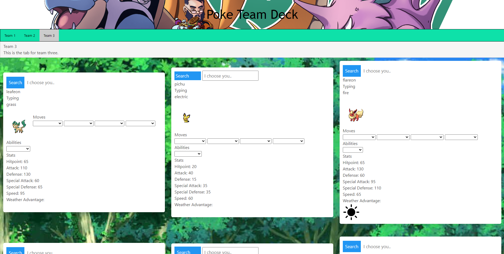

# project01-game-picker

Pokémon Team Manager

## Overview
Pokémon Team Manager is a hypothetical team-building application that allows Pokémon trainers to set up, save, and evaluate their Pokémon teams. Users can input their current team, save team configurations as presets, and even compare their teams against others to see which would hypothetically win in a battle.

## Features
•	Team Setup: Users can input a team of Pokémon and view their stats.
•	Save and Load Teams: Teams can be saved as presets and loaded for later use.
•	Team Comparison: Users can select two teams and see a hypothetical battle outcome based on stats. Outcomes are color-coded for clarity.

## Technologies Used
•	HTML, CSS, JavaScript
•	Bulma CSS Framework
•	Pokémon API- https://pokeapi.co/
•	Icons8 API- https://img.icons8.com/

## How to Use
1.	Navigate to the Team Setup page.
2.	Input your Pokémon to view their stats.
3.	Save your team as a preset for future use.

## Future Enhancements
•	Implement a full battle simulation based on Pokémon moves and types.
•	User account creation and management.

## Image of live webiste

## Live Application Link
Link to apllication: https://cbaca4.github.io/project01-game-picker/

